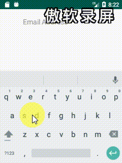

### AutoCompleteEmailTextView
> 感兴趣源码可以看看[博客](https://blog.csdn.net/MoLiao2046/article/details/104716849)
##### 依赖
- 在项目根目录build.gradle中配置repositories
    ```groovy
    allprojects {
        repositories {
            google()
            jcenter()
            //主要增加这个仓库
            maven {
                url 'https://dl.bintray.com/rgdzh1/Yey'
            }
        }
    }
    ```    
- 配置依赖, 在所在Module的build.gradle文件下
    ```groovy
     implementation 'com.yey.library_acemail:library_acemail:0.0.2'
    ```
##### 使用
- xml文件
    ```xml
    <com.yey.library_acemail.AutoCompleteEmailTextView
        android:id="@+id/acet"
        android:layout_width="200dp"
        android:layout_height="wrap_content"
        android:layout_gravity="center"
        android:layout_marginTop="20dp"
        android:hint="Email Address"
        android:lines="1"
        android:maxLength="30"
        android:textColor="@color/colorAccent"
        android:textSize="18sp"
        app:acetv_adapter_ietm="@layout/auto_email" />
    ```
- 代码
    ```java
    AutoCompleteEmailTextView emailTextView = (AutoCompleteEmailTextView) findViewById(R.id.acet);
    emailTextView.setEmailSufixs(new String[]{"@163.com", "@gmail.com", "@hotmail.com", "@jk.com", "@yuo.com"});
    ```
##### 效果

      